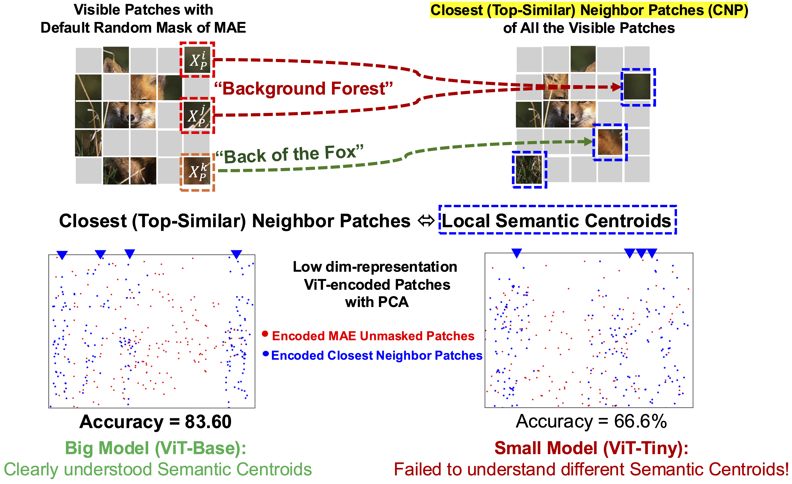

# NoR-MAE
Official Implementation of "Closest Neighbors are Harmful for Lightweight Masked Auto-encoders" (CVPR, 2025). 




## Get started

Create the Python environment and install the required packages. 

```
conda create --name nor-mae python=3.10
```

**Install the required dependencies:**

```
pip install -r requirements.txt
```

## Training and Fine-tuning

### Logging
We use Weight & Bias as the logging tool to monitor the training process. Meanwhile, a separate log file `log.txt` will be saved under the running directory. 

- Run `train_nor_mae.sh` to start the pre-training. Update the configuration (e.g., training epochs, dataset path) as needed.

- Execute `finetune.sh` to start the fine-tuning process based on the pre-trained model checkpoint. 


## Cite us

```
@inproceedings{meng2025closest,
  title={Closest Neighbors are Harmful for Lightweight Masked Auto-encoders},
  author={Meng, Jian and Hasssan Ahmed and Yang, Li and Shin, Jinwoo and Fan, Deliang and Seo, Jae-sun},
  booktitle={IEEE/CVF Conference on Computer Vision and Pattern Recognition (CVPR)},
  year={2025}
}
```
